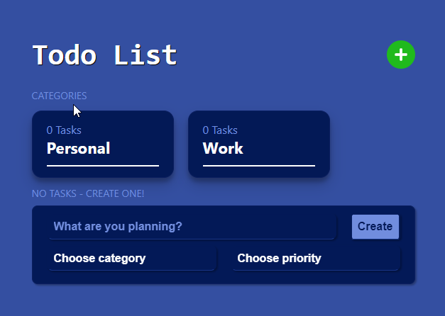

<div id="top"></div>

<!-- PROJECT LOGO -->
<div align="center">
  <a href="https://github.com/Delvoid/todo-app">
    
  </a>

  <h3 align="center">Todo App</h3>

  <p align="center">
    <a href="https://delvoid-todo.netlify.app/">View Demo</a>
    ·
    <a href="https://github.com/Delvoid/todo-app/issues">Report Bug</a>
    ·
    <a href="https://github.com/Delvoid/todo-app/issues">Request Feature</a>
  </p>
</div>

<!-- ABOUT THE PROJECT -->

## About The Project

<p align="center">
    
    
</p>


<p align="right">(<a href="#top">back to top</a>)</p>

### Features

- Create a task
- Complete a task
- Delete a task
- Default Categories and Priorities
- Filter by category
- Message toast notifications
- Drag and drop sorting

<p align="right">(<a href="#top">back to top</a>)</p>

### Built With

- [React.js](https://reactjs.org/)

<p align="right">(<a href="#top">back to top</a>)</p>

<!-- GETTING STARTED -->

## Getting Started

### Installation

1. Clone the repo
   ```sh
   git clone https://github.com/Delvoid/todo-app.git
   ```
2. Install NPM packages
   ```sh
   npm install
   ```
3. Start dev server
   ```js
   npm run dev
   ```

<p align="right">(<a href="#top">back to top</a>)</p>

<!-- Todo list -->

## Todo

- [] Add custom categories
- [] Add custom priorities
- [] Add more filters
  - [] search
  - [] complete
  - [] uncomplete

See the [open issues](https://github.com/Delvoid/todo-app/issues) for a full list of proposed features (and known issues).

<p align="right">(<a href="#top">back to top</a>)</p>

<!-- CONTACT -->

## Contact

David H - [Twitter](https://twitter.com/delvoid) - [Linkedin](https://www.linkedin.com/in/david-hough-45226268/) - delvoid.dev@gmail.com

Project Link: [https://github.com/Delvoid/todo-app](https://github.com/Delvoid/todo-app)

<p align="right">(<a href="#top">back to top</a>)</p>
